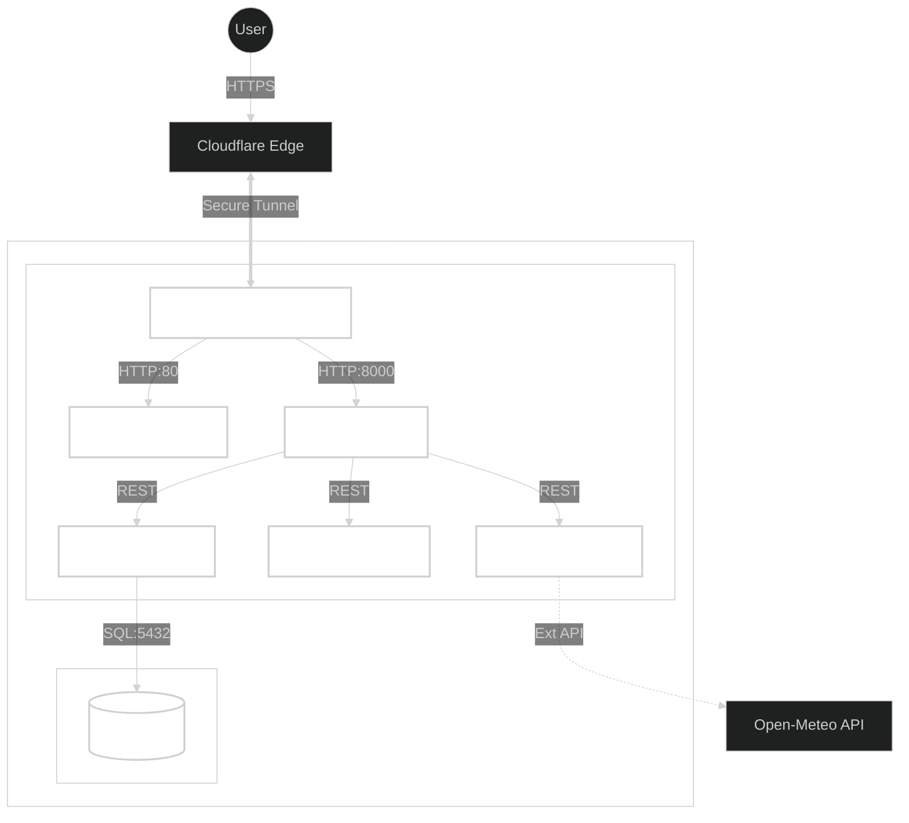
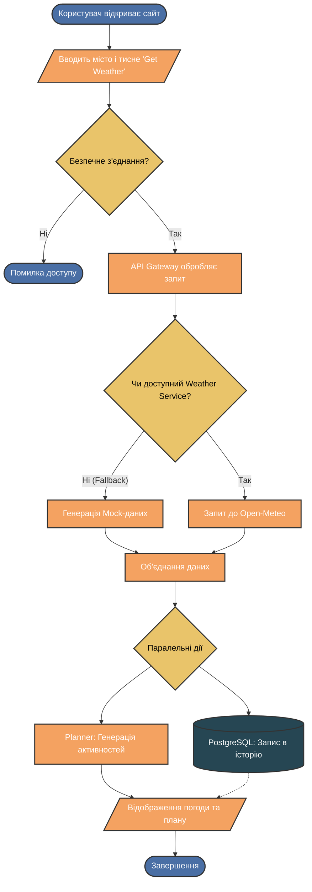

# 🌦️ WeatherHub: Microservices Deployment System


> **Курсовий проєкт** на тему: "Розробка системи автоматизованого розгортання мікросервісів з використанням Docker Compose".

WeatherHub — це розподілена інформаційна система для моніторингу погодних умов та планування активностей. Проєкт демонструє практичне застосування підходу **Infrastructure as Code (IaC)**, мікросервісної архітектури та технологій **Zero Trust** для безпечного доступу.

---

## 📸 Демонстрація головного інтерфейсу користувача: відображення погоди, плану та історії.


---

## 📑 Зміст
- [Проблематика та Рішення](#-проблематика-та-рішення)
- [Архітектура](#-архітектура-та-uml)
- [Технологічний Стек](#-технологічний-стек)
- [Встановлення та Запуск](#-встановлення-та-запуск)
- [Конфігурація](#-конфігурація)
- [API Ендпоінти](#-api-ендпоінти)
- [Автор](#-автор)

---

## 💡 Проблематика та Рішення

**Проблема:** Ручне розгортання та адміністрування мікросервісних систем на "голому залізі" (Bare Metal) є складним, схильним до помилок та створює ризики безпеки при відкритті портів назовні.

**Рішення:** Повна автоматизація процесу розгортання за допомогою **Docker Compose** та організація захищеного тунелювання через **Cloudflare Tunnel**.

**Ключові особливості:**
- **Zero Configuration Networking:** Не вимагає "білої" IP-адреси або відкритих портів.
- **Resilience:** Патерн *Fallback* забезпечує роботу системи навіть при збоях зовнішніх API.
- **Isolation:** База даних ізольована у внутрішній мережі, недоступній ззовні.

---

## 🏗 Архітектура та UML

Система побудована на базі 5 незалежних контейнерів, об'єднаних у віртуальні мережі.

### Діаграма розгортання (Deployment Diagram)



### User Flow (Потік даних)



---

## 🛠 Технологічний Стек

| Компонент | Технологія | Опис |
| :--- | :--- | :--- |
| **Orchestration** |  | Управління контейнерами та мережами |
| **Backend** |  | Асинхронний Python-фреймворк |
| **Database** |  | Збереження реляційних даних та JSONB |
| **Frontend** |  | Статичний веб-сервер |
| **Security** |  | Тунелювання та DDoS-захист |

---

## 🚀 Встановлення та Запуск

### Передумови
- Linux сервер (Debian/Ubuntu)
- Docker Engine v24.0+
- Docker Compose Plugin

### Крок 1. Клонування
```bash
git clone https://github.com/Stanislavwx/WeatherHub.git
cd weatherhub-cloudflare
```

### Крок 2. Налаштування оточення
Створіть файл `.env` на основі приклада:
```bash
cp .env.example .env
nano .env
```
*Необхідно вставити ваш `TUNNEL_TOKEN` від Cloudflare.*

### Крок 3. Запуск
```bash
docker compose up -d --build
```

### Крок 4. Верифікація
```bash
docker compose ps
```
*Усі контейнери повинні мати статус `Up (healthy)`.*

---

## ⚙️ Конфігурація

Приклад файлу `.env`:

```env
# Cloudflare Tunnel Token
TUNNEL_TOKEN=eyJhIjoi...

# Database Credentials
POSTGRES_DB=weatherhub
POSTGRES_USER=user
POSTGRES_PASSWORD=secure_pass

# Service Config
WEATHER_PROVIDER=open-meteo
WEATHER_TIMEOUT_SEC=3
```

---

## 🔌 API Ендпоінти

Система надає REST API для взаємодії. Повна документація доступна за адресою `/docs` (Swagger UI) після запуску.

- `GET /api/weather?city={city}` — Отримати поточну погоду.
- `GET /api/plan?city={city}` — Отримати рекомендації щодо активностей.
- `GET /api/history/weather` — Переглянути останні запити.
- `GET /health` — Перевірка стану системи (Healthcheck).

---

## 👨‍💻 Автор

**Чепара С.Б.**
- Студент групи ФЕП–23
- Львівський національний університет ім. І. Франка
- Факультет елекроніки та компʼютерних технологій
- Львів 2025

